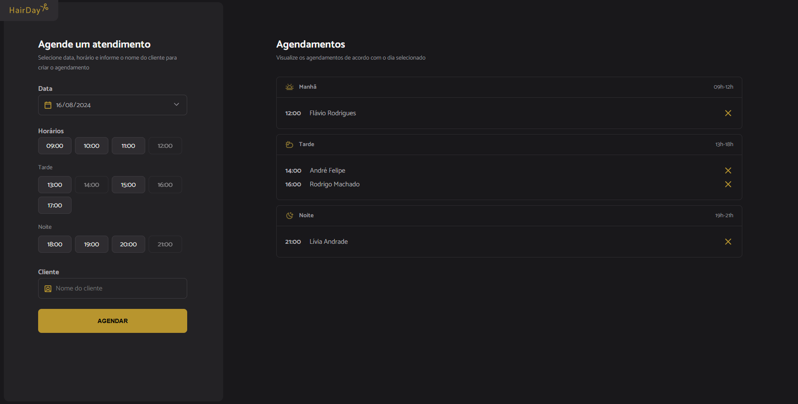

# Hair Day

> Hair Day é um site de agendamento de horários para corte de cabelo de uma barbearia.

## 🚀 Projeto formação Full-stack Rocketseat

Este projeto foi desenvolvido e aprimorado durante o curso full-stack da Rocketseat.

## 💻 Tecnologias

- HTML
- CSS
- Javascript

## ☕ Aprendizado

Foi aprendido como utilizar gerenciadores de projeto, estrutura de pastas, conexão
HTTP com a fetch api, json-server, dayjs, utilizar o webpack e seus plugins.

## 📝 Licença

Esse projeto está sob licença MIT.
