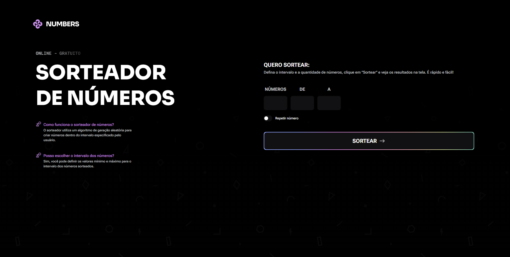

# Numbers

> Numbers é um site para sortear números aleatórios.

## 🚀 Projeto formação Full-stack Rocketseat

Este projeto foi desenvolvido e aprimorado durante o curso full-stack da Rocketseat.

Acesse:
https://beefreguglia.github.io/full-stack-numbers/

## 💻 Tecnologias

- HTML
- CSS
- Javascript

## ☕ Aprendizado

Foi aprendido como utilizar javascript para manipular a DOM.

## 📝 Licença

Esse projeto está sob licença MIT.
