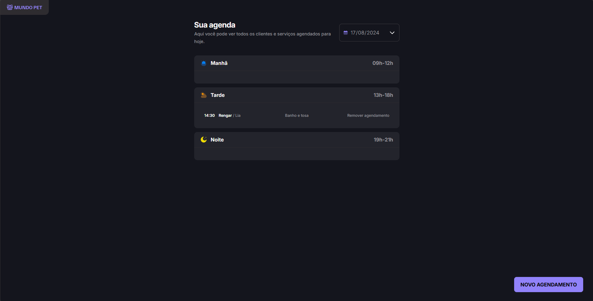

# Pet World



> Pet World é um site de agendamento de horários para Petshops.


## 🔧 Como rodar o projeto

- Acesse a pasta do projeto

```bash
npm install
```
- Rode o servidor

```bash
npm run server 
```

- Rode a aplicação
```bash
npm run dev
```

## 🚀 Projeto formação Full-stack Rocketseat

Este projeto foi desenvolvido e aprimorado durante o curso full-stack da Rocketseat.

## 💻 Tecnologias

- HTML
- CSS
- Javascript

## ☕ Aprendizado

Foi aprendido como utilizar gerenciadores de projeto, estrutura de pastas, conexão
HTTP com a fetch api, json-server, dayjs, utilizar o webpack e seus plugins.

## 📝 Licença

Esse projeto está sob licença MIT.
