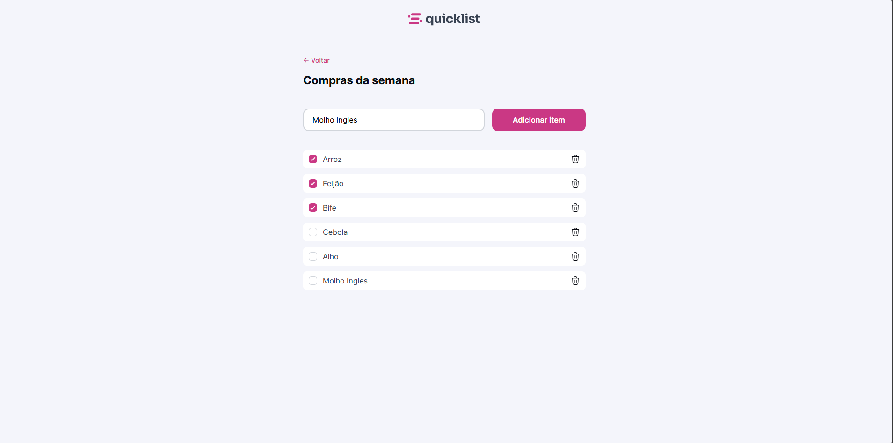

# Quicklist

> O Quicklist é uma lista de compras interativa que serve para adicionar as compras a serem feitas.

## 🚀 Projeto formação Full-stack Rocketseat

Este projeto foi desenvolvido e aprimorado durante o curso full-stack da Rocketseat.

Acesse:
https://beefreguglia.github.io/full-stack-quicklist/

## 💻 Tecnologias

- HTML
- CSS
- JS

## ☕ Aprendizado

Foi aprendido como utilizar o Javascript para manipular a DOM.

## 📝 Licença

Esse projeto está sob licença MIT.
