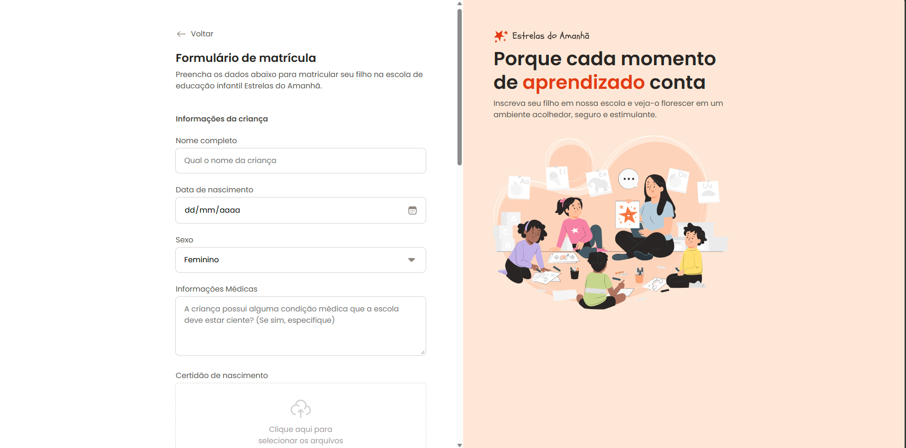

# Estrelas do Amanhã

> Estrelas do amanhã é um formulário para inscrição escolar de crianças.

## 🚀 Projeto formação Full-stack Rocketseat

Este projeto foi desenvolvido e aprimorado durante o curso full-stack da Rocketseat.

Acesse:
https://beefreguglia.github.io/full-stack-tomorrow-stars/

## 💻 Tecnologias

- HTML
- CSS

## ☕ Aprenizado

Foi aprendido como utilizar formulários e estilizar vários tipos de campos diferentes.

## 📝 Licença

Esse projeto está sob licença MIT.
