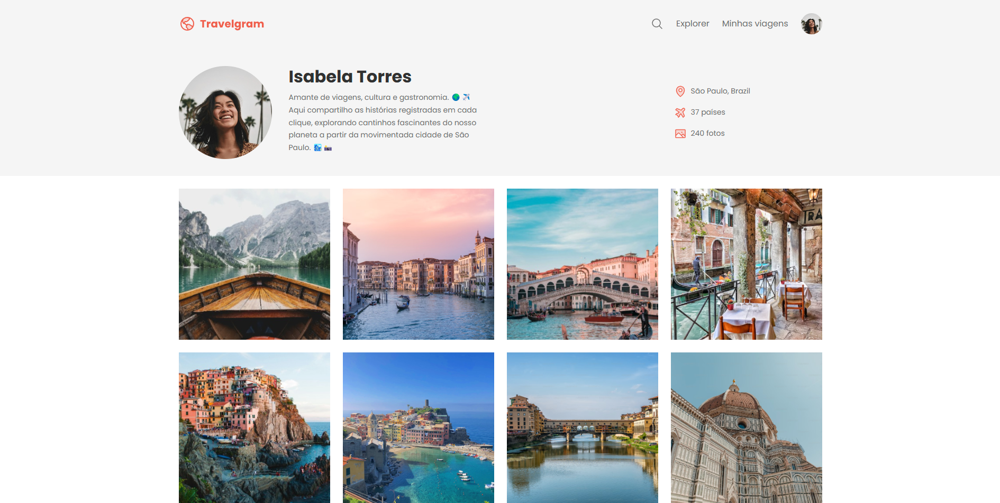

# Travelgram

> Blog para registro de fotos de viagens.

## 🚀 Projeto formação Full-stack Rocketseat

Este projeto foi desenvolvido e aprimorado durante o curso full-stack da Rocketseat.

Acesse:
https://beefreguglia.github.io/full-stack-travelgram/

## 💻 Tecnologias

- HTML
- CSS

## ☕ Aprenizado

Foi aprendido como criar HTML e CSS básico utilizando vários arquivos css, utilização de variáveis CSS e tags semânticas.

## 📝 Licença

Esse projeto está sob licença MIT.
