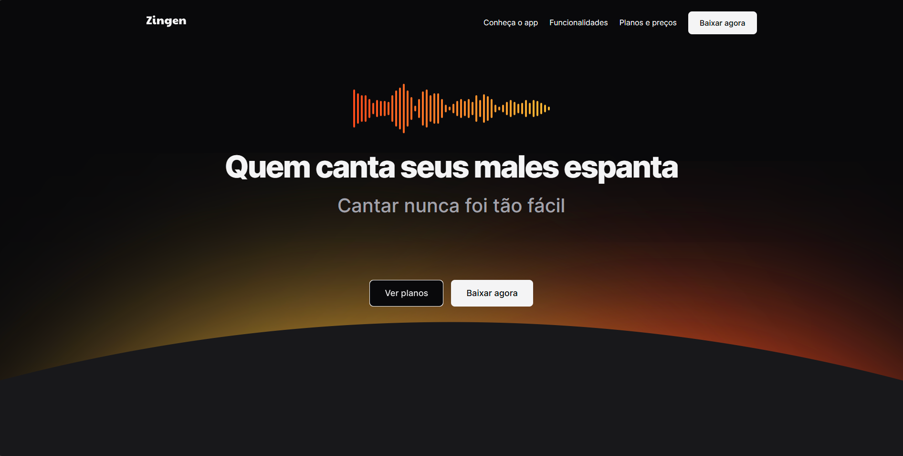

# Zingen

> Zingen é uma landing page de uma aplicação de Karaokê por assinatura.

## 🚀 Projeto formação Full-stack Rocketseat

Este projeto foi desenvolvido e aprimorado durante o curso full-stack da Rocketseat.

Acesse:
https://beefreguglia.github.io/full-stack-zingen/

## 💻 Tecnologias

- HTML
- CSS

## ☕ Aprenizado

Foi aprendido como utilizar o mobile first e conceitos de responsividade.

## 📝 Licença

Esse projeto está sob licença MIT.
